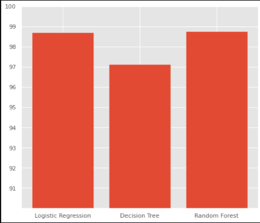
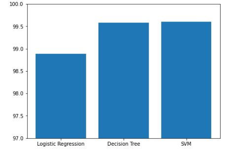
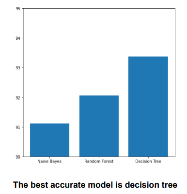

# Fake-news-detection
## Abstract
Today, "Fake news" is often mentioned, but it encompasses a collection of manipulated media designed to capture attention with sensational aesthetics, presenting a fabricated reality. It's more deceptive and dangerous than many realize. Our goal is to develop a Fake News Prediction System using machine learning in Python, training it to distinguish between real and fake articles and to quantify its accuracy.

### Formal Problem Description
A program learns from experience (E) with respect to a task (T) and performance measure (P), if its performance on T, as measured by P, improves with E:
- **Task (T)**: Predict whether provided data is real or fake.
- **Experience (E)**: A large amount of textual data from several thousand news articles.
- **Performance (P)**: Accuracy of predicting fake news correctly.

## Introduction
With rampant online fake news and misinformation, discerning truth from fiction is challenging. Our model aims to accurately predict the likelihood of an article being fake to help restore public trust.

### Motivation
Critiques following media attention, especially on platforms like Facebook which has begun to flag fake news, underscore the importance of our project.Facebook has been at the epicenter of many critiques following media attention. They have already implemented a feature to flag fake news on the site when a user sees it; they have also said publicly they are working on distinguishing these articles in an automated way. This problem provides a chance to learn more about textual data. The data we handled earlier were mostly numerical and didn’t need much data preprocessing. Since It is a Binary Classification, we ought to use logistic regression. But we still want to explore the different models to achieve higher accuracies. 

### Solution Benefits
Solving this problem will offer the capabilities of dealing with textual data, stemming and lemmatization. We ought to learn on few concepts on NLP and We believe it is meaningful because we never handled textual data while performing machine learning before. 
- Enhances capabilities with textual data, including stemming and lemmatization.
- Provides valuable learning in natural language processing (NLP), a new area for our previous work which was mainly numerical.

### Use of Solution
- This solution would be useful to classify even future articles for fake news. Although there can be more advanced models and open-source tools coming up, we believe our solution would work as an optimized solution for now. 
- To Classify the data, we always need to preprocess and fetch an accurate and most suitable machine learning model. Like we mentioned, Since it is a Binary Classification, we fixated on Logistic regression. But we still look forward to an optimized solution. Emphasizes data preprocessing and model accuracy.
- 

## Dataset Finalization
We use labeled datasets with textual content from thousands of articles categorized as real or fake. Key datasets include:
- **Dataset 1**: Labeled data focusing on US elections and Donald Trump-related fake articles.
  - [Kaggle Dataset](https://www.kaggle.com/c/fake-news/data?select=train.csv)
  - **Features**:
    - **id**: Unique ID for a news article.
    - **title**: The title of a news article.
    - **author**: Author of the news article.
    - **text**: The text of the article; could be incomplete.
    - **label**: A label that marks the article as potentially unreliable.
  - **Background**: This dataset was used in an InClass Prediction competition in 2015, mainly focusing on US presidential elections and fake articles about Donald Trump.

- **Dataset 2**: Real and fake news datasets.
  - [Kaggle Dataset](https://www.kaggle.com/clmentbisaillon/fake-and-real-news-dataset)
  - **Description**: This dataset is divided into real and fake CSV datasets.
  - **Features**:
    - **title**: The title of a news article.
    - **text**: The text of the article.
    - **subject**: The subject or category of the news article.
    - **date**: The date the article was published.
  - **Fake news Dataset**:
    - **Total Records**: 17,903 unique values.
    - **Distribution**:
      - 29% from political articles.
      - 39% from general news.
      - 32% from various other categories.
    - **Time Frame**: From 31st March 2015 to 19th February 2018.
  - **Real news Dataset**:
    - **Total Records**: 20,826 unique values.
    - **Distribution**:
      - 53% politics news.
      - 47% world news.
    - **Time Frame**: From 16th January 2016 to 31st December 2017.

- **Dataset 3**: Articles from websites tagged by the BS Detector Chrome Extension.
  - [Kaggle Dataset](https://www.kaggle.com/mrisdal/fake-news)
  - **Description**: This dataset contains text and metadata scraped from 244 websites tagged as "bullshit" by the BS Detector Chrome Extension by Daniel Sieradski.
  - **Features**:
    - **Uuid**: Unique user ID.
    - **Ord_in_thread**: Order in thread.
    - **Author**: Author of the article.
    - **Published date**: Date when the article was published.
    - **Title**: Title of the article.
    - **Text**: Main text content of the article.
    - **Language**: Language in which the article is written.
    - **Crawled**: Date when the article was crawled.
    - **Site URL**: URL of the website.
    - **Country**: Country of the website.
  - **Usage**: This dataset was also used for Sentiment Analysis in a beginner Kaggle competition.

## Data Preprocessing
- **Stopwords Removal**: Using NLTK to eliminate irrelevant words.
- **Stemming**: Applying the Porter stemming algorithm to reduce words to their root form.
- **Lemmatization**: Transforming words to their base form using Wordnet.

## Supervised Learning Algorithms

### Naive Bayes
Naive Bayes is a classification algorithm used for tasks where features are considered independent. This assumption makes it particularly efficient, even in high-dimensional spaces like text classification and email spam detection.Naive Bayes is a supervised learning algorithm used for classification tasks. Hence, it is also called Naive Bayes Classifier.As other supervised learning algorithms, naive bayes uses features to make a prediction on a target variable. The key difference is that naive bayes assumes that features are independent of each other and there is no correlation between features. 
Pros of Naive Bayes Algorithm 
The assumption that all features are independent makes naive bayes algorithm very fast compared to complicated algorithms. In some cases, speed is preferred over higher accuracy.It works well with high-dimensional data such as text classification, email spam detection.

- **Application**: Used on Dataset 3.
- **Performance**: Achieved an accuracy of approximately 91.3%.

### Logistic Regression
Logistic Regression is used to predict the probability of a binary target variable, effectively handling dichotomous dependent variables.:Logistic algorithem is a supervised learning classification algorithm used to predict the probability of a target variable. The nature of target or dependent variable is dichotomous, which means there would be only two possible classes. 
In simple words, the dependent variable is binary in nature having data coded as either 1 (stands for success/yes) or 0 (stands for failure/no). 
The models were trained and accuracies were estimated through convolution matrices.
- **Application**: Applied to Dataset 1 and Dataset 2.
- **Performance**:
  - Dataset 1: Achieved an accuracy of 97.8%.
  - Dataset 2: Achieved an accuracy of 98.88%.

### Random Forest
Random Forest uses an ensemble of decision trees to improve model performance and prevent overfitting, suitable for both classification and regression.

- **Application**: Implemented on Dataset 1 and Dataset 2.
- **Performance**:
  - Dataset 1: Achieved an accuracy of 98.75%.
  - Dataset 2: Achieved an accuracy of 92.06%.

### Decision Tree
Decision Trees are intuitive models used for classification and regression. They require minimal data preparation and are unaffected by missing values.Decision Tree is a Supervised learning technique that can be used for both classification and Regression problems, but mostly it is preferred for solving Classification problems. 
In a Decision tree, there are two nodes, which are the Decision Node and Leaf Node. Decision nodes are used to make any decision and have multiple branches, whereas Leaf nodes are the output of those decisions and do not contain any further branches. The decisions or the test are performed on the basis of features of the given dataset. A decision tree simply asks a question, and based on the answer (Yes/No), it further splits the tree into subtrees. 
Advantages:
- Compared to other algorithms decision trees requires less effort for data preparation during pre-processing.
- A decision tree does not require normalization of data.
- A decision tree does not require scaling of data as well.
- Missing values in the data also do NOT affect the process of building a decision tree to any considerable extent.
- A Decision tree model is very intuitive and easy to explain to technical teams as well as stakeholders.

- **Application**: Employed across all three datasets.
- **Performance**:
  - Dataset 1: 97.34% accuracy.
  - Dataset 2: 98.07% accuracy.
  - Dataset 3: 93.37% accuracy.

### Support Vector Machine (SVM)
SVM is effective for classification tasks, especially in high-dimensional spaces where the number of features exceeds the number of samples.: Support Vector Machine(SVM) is a supervised machine learning algorithm used for both classification and regression. Though we say regression problems as well, it's best suited for classification. The objective of the SVM algorithm is to find a hyperplane in an N-dimensional space that distinctly classifies the data points. The dimension of the hyperplane depends upon the number of features.
Advantages:
- SVM works relatively well when there is a clear margin of separation between classes.
- SVM is more effective in high dimensional spaces.
- SVM is effective in cases where the number of dimensions is greater than the number of samples.
- SVM is relatively memory efficient

- **Application**: Utilized for Dataset 2 - Fake and Real News Dataset.
- **Performance**: Achieved an accuracy of 99.6%, with 4231 true positives and 20 false positives.

### DATASET 1 BEST FIT : Logistic Regression 

### DATASET 2 BEST FIT : Support Vector Machine 

### DATASET 3 BEST FIT: Decision Tree

## Unsupervised Learning
- **PCA (Principal Component Analysis)**: Used for feature reduction but showed moderate performance. Principal Component Analysis : Principal component analysis is a technique for feature extraction — so it combines our input variables in a specific way, then we can drop the “least important” variables while still retaining the most valuable parts of all of the variables.
We took 3 pca components and calculated accuracy.Here is the visual representation of the 3 components modelled through PCA.Although the accuracy was around 0.5,It performed better than Kmeans Clustering.

- **K-means Clustering**: Attempted to segment data into clusters; however, showed limited success.K-means is an unsupervised clustering algorithm designed to partition unlabelled data into a certain number (thats the “ K”) of distinct groupings. In other words, k-means finds observations that share important characteristics and classifies them together into clusters. A good clustering solution is one that finds clusters such that the observations within each cluster are more similar than the clusters themselves.
We divided the dataset to 3 clusters and modelled with Kmeans.Though we performed 500 iterations , it performed relatively poor with a miniscule accuracy of 0.01%.

- **Long Short-Term Memory (LSTM)** :  learns to keep only relevant information to make predictions, and forget non relevant data.It processes data passing on information as it propagates forward.The cell state act as a transport highway that transfers relative information all the way down the sequence chain. You can think of it as the “memory” of the network. The cell state, in theory, can carry relevant information throughout the processing of the sequence. So even information from the earlier time steps can make it’s way to later time steps, reducing the effects of short-term memory. The gates can learn what information is relevant to keep or forget during training.
Dataset 2 and Dataset3 are modelled through LSTM.They both showed an accuracy of 99% and 93% respectively.
LSTMs provide us with a large range of parameters such as learning rates, and input and output biases. Hence, no need for fine adjustments. 
The complexity to update each weight is reduced to O(1) with LSTMs
Long Short-Term Memory (LSTM)
- Applied to Datasets 2 and 3 with high accuracies. LSTMs manage data sequences effectively by retaining relevant information over time.

## Conclusion

Throughout this project, we have successfully developed and tested a Fake News Prediction System utilizing various machine learning algorithms to differentiate between real and fake news articles. By integrating models like Naive Bayes, Logistic Regression, Random Forest, Decision Trees, and Support Vector Machines, we achieved high levels of accuracy, demonstrating the effectiveness of our approach in tackling the problem of misinformation.

Key achievements include:
- High accuracy rates, with Logistic Regression and SVM performing exceptionally well on structured datasets.
- Effective handling and preprocessing of textual data, which enhanced the performance of our machine learning models.
- Gaining practical experience in natural language processing techniques such as stemming, lemmatization, and vectorization.

This project not only provided us with deep insights into the mechanics of fake news detection but also equipped us with valuable skills in data science and machine learning applicable to a wide range of real-world problems. Looking forward, we aim to explore more sophisticated models and incorporate real-time data processing to keep improving our solution’s accuracy and reliability. Our ultimate goal is to contribute to a more informed and truthful digital media landscape.
